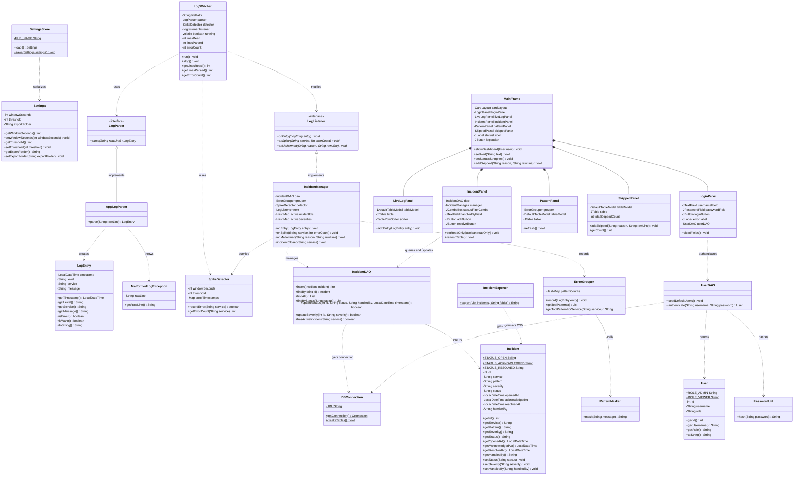

# LogLens Class Diagram

The following Mermaid diagram illustrates the core domain models, interfaces, engine components, data access objects, utilities, and UI classes in the LogLens project.

```mermaid
classDiagram
    direction TB

    %% Model Layer
    class LogEntry {
        -LocalDateTime timestamp
        -String level
        -String service
        -String message
        +getTimestamp() LocalDateTime
        +getLevel() String
        +getService() String
        +getMessage() String
        +isError() boolean
        +isWarn() boolean
        +toString() String
    }

    class Incident {
        +STATUS_OPEN String$
        +STATUS_ACKNOWLEDGED String$
        +STATUS_RESOLVED String$
        -int id
        -String service
        -String pattern
        -String severity
        -String status
        -LocalDateTime openedAt
        -LocalDateTime acknowledgedAt
        -LocalDateTime resolvedAt
        -String handledBy
        +getId() int
        +getService() String
        +getPattern() String
        +getSeverity() String
        +getStatus() String
        +getOpenedAt() LocalDateTime
        +getAcknowledgedAt() LocalDateTime
        +getResolvedAt() LocalDateTime
        +getHandledBy() String
        +setStatus(String status) void
        +setSeverity(String severity) void
        +setHandledBy(String handledBy) void
    }

    class User {
        +ROLE_ADMIN String$
        +ROLE_VIEWER String$
        -int id
        -String username
        -String role
        +getId() int
        +getUsername() String
        +getRole() String
        +toString() String
    }

    class Settings {
        -int windowSeconds
        -int threshold
        -String exportFolder
        +getWindowSeconds() int
        +setWindowSeconds(int windowSeconds) void
        +getThreshold() int
        +setThreshold(int threshold) void
        +getExportFolder() String
        +setExportFolder(String exportFolder) void
    }

    %% Exception Layer
    class MalformedLogException {
        -String rawLine
        +getRawLine() String
    }

    %% Parser Layer
    class LogParser {
        <<interface>>
        +parse(String rawLine) LogEntry*
    }

    class AppLogParser {
        +parse(String rawLine) LogEntry
    }
    LogParser <|-- AppLogParser : implements
    AppLogParser ..> LogEntry : creates
    AppLogParser ..> MalformedLogException : throws

    %% Engine Layer
    class LogListener {
        <<interface>>
        +onEntry(LogEntry entry) void*
        +onSpike(String service, int errorCount) void*
        +onMalformed(String reason, String rawLine) void*
    }

    class LogWatcher {
        -String filePath
        -LogParser parser
        -SpikeDetector detector
        -LogListener listener
        -volatile boolean running
        -int linesRead
        -int linesParsed
        -int errorCount
        +run() void
        +stop() void
        +getLinesRead() int
        +getLinesParsed() int
        +getErrorCount() int
    }
    LogWatcher ..> LogParser : uses
    LogWatcher ..> SpikeDetector : uses
    LogWatcher ..> LogListener : notifies

    class SpikeDetector {
        -int windowSeconds
        -int threshold
        -Map errorTimestamps
        +recordError(String service) boolean
        +getErrorCount(String service) int
    }

    class ErrorGrouper {
        -HashMap patternCounts
        +record(LogEntry entry) void
        +getTopPatterns() List
        +getTopPatternForService(String service) String
    }

    class PatternMasker {
        +mask(String message)$ String
    }
    ErrorGrouper ..> PatternMasker : calls

    class IncidentManager {
        -IncidentDAO dao
        -ErrorGrouper grouper
        -SpikeDetector detector
        -LogListener next
        -HashMap activeIncidentIds
        -HashMap activeSeverities
        +onEntry(LogEntry entry) void
        +onSpike(String service, int errorCount) void
        +onMalformed(String reason, String rawLine) void
        +incidentClosed(String service) void
    }
    LogListener <|.. IncidentManager : implements
    IncidentManager ..> IncidentDAO : manages
    IncidentManager ..> ErrorGrouper : records
    IncidentManager ..> SpikeDetector : queries

    %% DAO & Database Layer
    class DBConnection {
        -URL String$
        +getConnection()$ Connection
        +createTables()$ void
    }

    class IncidentDAO {
        +insert(Incident incident) int
        +findById(int id) Incident
        +findAll() List
        +findByStatus(String status) List
        +updateStatus(int id, String status, String handledBy, LocalDateTime timestamp) boolean
        +updateSeverity(int id, String severity) boolean
        +hasActiveIncident(String service) boolean
    }
    IncidentDAO ..> DBConnection : gets connection
    IncidentDAO ..> Incident : CRUD

    class UserDAO {
        +seedDefaultUsers() void
        +authenticate(String username, String password) User
    }
    UserDAO ..> DBConnection : gets connection
    UserDAO ..> User : returns
    UserDAO ..> PasswordUtil : hashes

    %% Utilities
    class PasswordUtil {
        +hash(String password)$ String
    }

    class SettingsStore {
        -FILE_NAME String$
        +load()$ Settings
        +save(Settings settings)$ void
    }
    SettingsStore ..> Settings : serializes

    class IncidentExporter {
        +export(List incidents, String folder)$ String
    }
    IncidentExporter ..> Incident : formats CSV

    %% UI Layer
    class MainFrame {
        -CardLayout cardLayout
        -LoginPanel loginPanel
        -LiveLogPanel liveLogPanel
        -IncidentPanel incidentPanel
        -PatternPanel patternPanel
        -SkippedPanel skippedPanel
        -JLabel statusLabel
        -JButton logoutBtn
        +showDashboard(User user) void
        +setAlert(String text) void
        +setStatus(String text) void
        +addSkipped(String reason, String rawLine) void
    }

    class LoginPanel {
        -JTextField usernameField
        -JPasswordField passwordField
        -JButton loginButton
        -JLabel errorLabel
        -UserDAO userDAO
        +clearFields() void
    }
    LoginPanel ..> UserDAO : authenticates

    class LiveLogPanel {
        -DefaultTableModel tableModel
        -JTable table
        -TableRowSorter sorter
        +addEntry(LogEntry entry) void
    }

    class IncidentPanel {
        -IncidentDAO dao
        -IncidentManager manager
        -JComboBox statusFilterCombo
        -JTextField handledByField
        -JButton ackButton
        -JButton resolveButton
        +setReadOnly(boolean readOnly) void
        +refreshTable() void
    }
    IncidentPanel ..> IncidentDAO : queries and updates

    class PatternPanel {
        -ErrorGrouper grouper
        -DefaultTableModel tableModel
        -JTable table
        +refresh() void
    }

    class SkippedPanel {
        -DefaultTableModel tableModel
        -JTable table
        -int totalSkippedCount
        +addSkipped(String reason, String rawLine) void
        +getCount() int
    }

    MainFrame *-- LoginPanel
    MainFrame *-- LiveLogPanel
    MainFrame *-- IncidentPanel
    MainFrame *-- PatternPanel
    MainFrame *-- SkippedPanel
```
